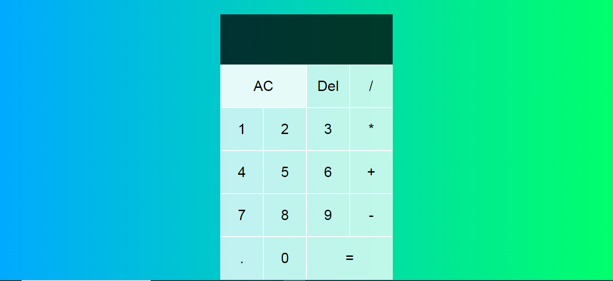
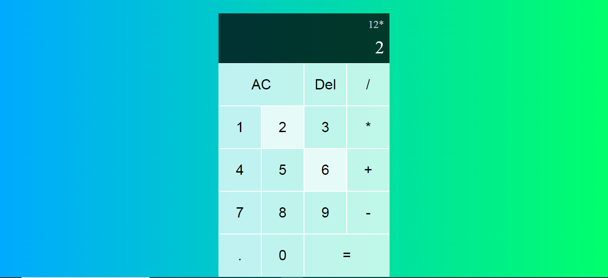

# Mathify
> Simplify your calculations with a sleek and intuitive calculator built on React.js.

## Table of Content 
- [General Info](#general-info)
- [Technologies](#technologies)
- [Glimpese](#glimpse)
- [How to Run](#how-to-run)
    - [Live Demo](#live-demo)
    - [Run Locally](#run-locally)
- [Features](#features)
- [Other Details](#other-details)

## General Info
A beginner project calculator, Mathify made with React.js is a simple application that allows users to perform basic mathematical calculations. It provides a user-friendly interface where users can input numbers, select mathematical operations such as addition, subtraction, multiplication, and division, and obtain the result instantly. This calculator project helps beginners learn the fundamentals of React.js, including component rendering, state management, event handling, and conditional rendering.


## Technologies
This calculator application leverages the power core web technologies of HTML for structure, CSS for styling, JavaScript for logic, and React.js for building modern and interactive components, resulting in a seamless and feature-rich calculator interface. 
<p>
    <a href="https://pytorch.org/" target="_blank" rel="noreferrer">
        
    </a>
    <a href="https://www.python.org" target="_blank" rel="noreferrer">
        
    </a>
    <a href="https://pytorch.org/" target="_blank" rel="noreferrer">
        
    </a>
    <a href="https://www.python.org" target="_blank" rel="noreferrer">
        
    </a>
</p>

## Glimpse
<p>
    
    
</p>

## How to Run
### Live Demo
Live demo at <a href="https://themathify.netlify.app/">Mathify</a>

### Run Locally
- Clone the reposiory in your local machine.
```bash
git clone https://github.com/Anuj-Khadka/mathify.git
```
- Open the terminal inside the project folder.
- Run the command
```bash
npm run dev
```
- Open the port in your browser `localhost:5173/` <br/>

## Features
- Simple mathematical DMAS operations.
- Single character erase from backward.
- Clear entire screen.
- Previous calculation's display along with the current one.
- Easy User Experience.

## Other Details
 <p align="left">
    
    
    
  <!--  
    
                                           -->                                                                        
</p>
